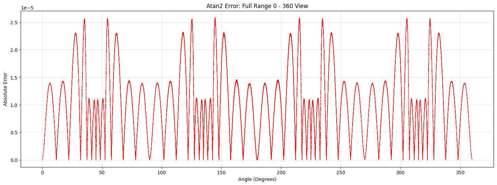
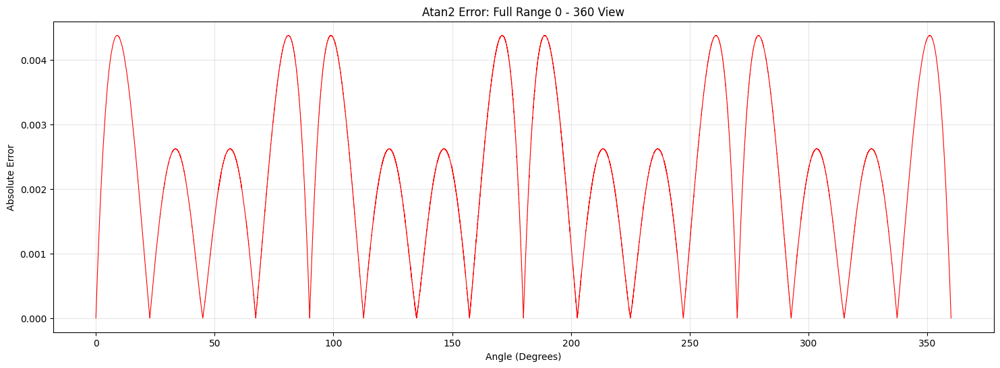

# IAA03_fast_math

## High-Performance Branchless Trigonometry for C++14.

IAA03_fast_math is a single-header math kernel designed to eliminate the "Trigonometry Tax" in high-throughput systems (Physics Engines, Audio DSP, and ML Pre-processing). By utilizing Branchless Octant Folding , ILP and SIMD (AVX2/SSE4.1), it achieves up to a 178x per-element throughput speedup over std::atan2 while being IEEE 754 compliant.
### Key features:
-  **Branchless** , No control flow in the hot path to avoid cpu stalls and cache misses.
-  **Single Instruction Multiple Data (SIMD)** , as the entire function is *Branchless* , this makes it SIMD ready.
-  **Instruction Level Parallelism (ILP)** , by splitting the logic further and repositioning them ,we can utilize Out of Order execution(OoO) to hide latency further more.
-  **IEEE 754 compliance** , by using bitwise operators and float's IEEE properties we can protect ourselves from infinity and nan as well as division by zero.
-  **Accuracy increase near octant edges** , due to how the atan curves being calculated ,they zoom in on zero the closer they are to the octant edges(axis and diagonals)
  
### Benchmarks
*benchmarked on :11th Gen Intel® Core™ i5-1155G7 processor 4 cores, Max Turbo Frequency 4.5 GHz using the accompenying tests header*
<table style="border: 2px solid blue;border-radius: 2px">
  <tr>
    <th>Implementation</th>
    <th>Time(max/min) (1B xy pair)</th>
    <th>Per Element</th>
    <th>Variance(max / min)</th>
    <th>execution time Speedup</th>
    <th>thoughput speedup</th>
  </tr>
  <tr>
    <td>std::atan2</td>
    <td>29.15 ms</td>
    <td>29.15 ns</td>
    <td>(34.81 / 23.06) ms</td>
    <td>1.0x</td>
    <td>1.0x</td>
  </tr>
  <tr>
    <th colspan="2"><bold>IAA03 High Accuracy Atan2</bold></th>
  </tr>
  <tr>
    <td>Scalar</td>
    <td>16.61 ms</td>
    <td>16.61 ns</td>
    <td>(24.45 / 13.28 ) ms</td>
    <td>~1.75x</td>
    <td>~1.75x</td>
  </tr>
  <tr>
    <td>SIMD4 (SSE)</td>
    <td>3.12 ms</td>
    <td>0.78 ns</td>
    <td>(3.91 / 2.18)ms</td>
    <td>~9.33x</td>
    <td>~37.31x</td>
  </tr>
  <tr>
    <td>SIMD8 (AVX2)</td>
    <td>1.80 ms</td>
    <td>0.23 ns</td>
    <td>(3.10 / 1.25) ms</td>
    <td>~16.16x</td>
    <td>~129.35x</td>
  </tr>
  <tr>
    <th colspan="2"><bold>IAA03 Fast Atan2</bold></th>
  </tr>
  <tr>
    <td>Scalar</td>
    <td>11.81 ms</td>
    <td>11.81 ns</td>
    <td>(13.81 / 9.31) ms</td>
    <td>~2.47x</td>
    <td>~2.47x</td>
  </tr>
  <tr>
    <td>SIMD4 (SSE)</td>
    <td>2.59 ms</td>
    <td>0.65 ns</td>
    <td>(3.59 / 1.71)ms</td>
    <td>~11.24x</td>
    <td>~44.94x</td>
  </tr>
  <tr>
    <td>SIMD8 (AVX2)</td>
    <td>1.25 ms</td>
    <td>0.16 ns</td>
    <td>(1.89 / 1.04) ms</td>
    <td>~23.27x</td>
    <td>~186.19x</td>
  </tr>
</table>

### Accuracies and Error Distribution Plots:
<table>
  <tr>
    <th>Type</th>
    <th>Max error radians(degrees)</th>
    <th>Avrg error radians(degrees)</th>
    <th>Absolute error & Symmetry Verification</th>
  </tr>
  <tr>
    <th>High Accuracy</th>
    <th>2.57492e-05 radians (1.47532e-3 degrees)</th>
    <th>1.05807e-05 radians (6.06227e-4 degrees)</th>
    <td>

  
📊 Click to view detailed Error Distribution Plots

   
  

</td>
  </tr>
  <tr>
    <th>Fast</th>
    <th>4.37665e-3 radians (2.50764e-1 degrees)</th>
    <th>2.09574e-3 radians (1.20077e-1 degrees)</th>
    <td>

  
📊 Click to view detailed Error Distribution Plots

   
  
  

</td></td>
  </tr>
</table>

<i>Note: Observe how the error zoom into zero at Axis and Diagonals. </i>

